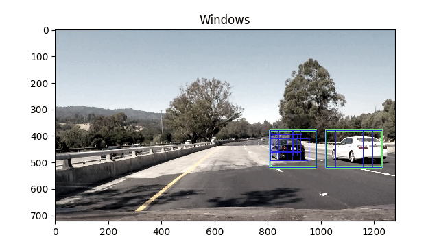
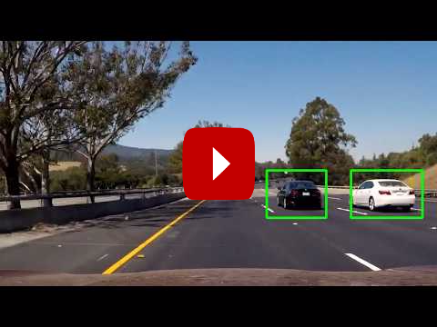

# Vehicle Detector [](http://www.udacity.com/drive)

<a align="center" href="http://petermoran.org"></a>


# The Project

My goals for this project were to:

* Clean up an image dataset by **removing duplicate images** (or near duplicate).
* **Extract features** from that labeled training set of images to build a feature vector containing:
  * **Histogram of Oriented Gradients** (HOG) features.
  * **Color histogram** features.
  * **Spatial color** features.
* Train a **Linear SVM** classifier to identify cars vs not-cars based on .
* **Search for vehicles** using the SVM and a **sliding-window technique**.
* Estimate a bounding box for vehicles detected.

# How it Works

This vehicle detector uses a sliding window search with a nonlinear SVM to classify different window in an image as containing a car or not. From that, we integrate over time to remove false positive classifications. Before I can discuss the detection pipeline, however, I'll need to explain the sample selection and training process.

**Sample Selection**

For the project, just over 8000 64x64px combined images of vehicles and not-vehicle classes were provided (discussed further below). Because these samples come from video, **many of the images appear near-identical** due to consecutive fames of video looking very similar. Rather than training with this dataset, which would result in artificially high validation accuracy or lead to a less diverse training set, I removed near-duplicate images. This is done by `clean_dataset.py`, which uses an image hashing algorithm to inspect each image one at a time and reject any new images that do not have a great enough hamming distance from the previously observed image hashes. After tuning this to provide a decent balance of diversity and sample quantity, I had ~2800 samples of vehicles and non-vehicles (with 50% from each class).

**Feature Extraction & Training**

Before training the SVM, I needed to obtain feature vectors for each image to train with. This is done by `CarFeatureVectorBuilder` in `feature_extraction.py` which is highly flexible and allow for quick re-tuning of feature extraction all in one place, including the ability to add new types of features. The current implementation pre-converts all images to the YCrCb color space and then combines Histogram of Oriented Gradients (HOG), color histogram, and spatial color features into a single feature vector containing 8460 features.

Next, I extracted the features from my selected samples and performed a random parameter search to tune the rbf-kernel SVM, which runs the SVM with various different settings for the `C` and `gamma` hyper parameters. The best parameterization used `C=65.1` and `gamma=.0000882` and has a 89.2% accuracy when tested on the culled subset of unique images.

**Detection**

Once the SVM is trained, different segments of the image are classified as car or not-car by using three different scales of a sliding window search, with the SVM classifying the contents of each window. Scaling allows us to detect vehicles of different sizes and distances. Below is an example of the window classifications in a single video frame. The blue boxes are 'vehicle' windows and the green boxes are the extents of the detected cars.



False positive classifications are not uncommon frame by frame. We filter these out by accumulating a 16 frame heat map, which is the combination of each widow classified as a vehicle where each one contributes a magnitude of heat proportional to the SVM's confidence of that classification. 


Next, we remove any pixels from the accumulated heatmap with an intensity below a certain threshold, label the connected regions in the heatmap using `scipy.ndimage.measurements.label()`, and find a bounding box that contains all of the pixels in that region. When we do this, we also check the intensity of the heatmap at the very center of that bounding box. If the intensity is below some upper threshold then the label region is not used. This has a similar effect to hysteresis thresholding and ensures we use only the strongest regions with the most overlapping classifications, but also allows us to use the full extent of that connected region. The bounding boxes for the approved regions are then considered detected cars and are drawn in the video output.

# Results

In the final output and in the [diagnostic video](https://www.youtube.com/watch?v=wKw9EWHOrDI) (which shows the per-frame SVM classifications), you can see that the system is able to:

* **Reliably locate vehicles** within a reasonable distance from the camera.
* **Properly rejects false positive classifications**, preventing any bounding boxes from being placed around objects that are not truly cars.

This system has some areas to improve. Because the classifier was trained using full body images of vehicles, it cannot detect vehicles that are partially occluded. This especially delays it from quickly detecting new cars entering from the side of the image. In a real world system where fast identification is needed, it would be better to train the classifier to also identify partial or occluded vehicles, or use a dedicated classifier for doing this around the image's edge. A deep learning approach may provide even better results too. Secondly, the detector cannot distinguish multiple instances of a vehicle when their bounding boxes overlap. This means for any selected bounding box, we can only be confident there is one *or more* cars contained in it, rather than just a single car.


<a align="center" href="https://www.youtube.com/watch?v=xIOZcZ6eihM"></a>	

---

# Installation

## This Repository

Download this repository by running:

```sh
git clone https://github.com/peter-moran/vehicle-detector.git
cd vehicle-detector
```

## Software Dependencies

This project utilizes the following, easy to obtain software:

- Python 3
- OpenCV 2
- Matplotlib
- Numpy
- SciPy
- Scikit-learn
- Moviepy
- [tqdm](https://github.com/noamraph/tqdm)
- [imagehash](https://github.com/JohannesBuchner/imagehash)

An easy way to obtain these is with the [Udacity CarND-Term1-Starter-Kit](https://github.com/udacity/CarND-Term1-Starter-Kit) and Anaconda. To do so, run the following (or see the [full instructions](https://github.com/udacity/CarND-Term1-Starter-Kit/blob/master/doc/configure_via_anaconda.md)):

```
git clone https://github.com/udacity/CarND-Term1-Starter-Kit.git
cd CarND-Term1-Starter-Kit
conda env create -f environment.yml
activate carnd-term1
```

And then install the rest (while still in that environment) by running:

```
pip install imagehash
```

## Data Dependencies

If you want to re-train the classifier with new feature vectors, you will need the original datasets to extract features from. They each contain over 8000 samples of 64x64 images of vehicles vs not vehicle images. These images were given by Udacity and come from a combination of the [GTI vehicle image database](http://www.gti.ssr.upm.es/data/Vehicle_database.html), the [KITTI vision benchmark suite](http://www.cvlibs.net/datasets/kitti/), and examples extracted from the test video itself. 

* [Vehicle](https://s3.amazonaws.com/udacity-sdc/Vehicle_Tracking/vehicles.zip) data set.
* [Non-vehicle](https://s3.amazonaws.com/udacity-sdc/Vehicle_Tracking/non-vehicles.zip) data set.

If you place the top level `vehicles` and `non-vehicles` folders from these zip files in the `./data/` folder, all of the programs should be able to find them with the default arguments.

---

# Basic Usage

If all you want to do is run the pre-trained classifier on a video, all you need to do is run `find_cars.py`. There are a bunch of different options for running it, but they are all optional.

To find cars in a specific video (such as the ones in `./data/test_videos/`), run:

```
python find_cars.py -vi <input_video_path> -vo <output_video_save_path>
```

Additional options are discussed below.

---

# Advanced Usage

## Sample Selection

The datasets provided by Udacity have a lot of near duplicate images, something that is really easy to tell if you open the first few images in the dataset. The near-duplicates can be found consecutively, which is because the images were extracted from video, and many samples are only a short time step apart.

In order to create a dataset with a more diverse set of samples, you can use `clean_dataset.py`, which uses an image hashing algorithm to determine how unique images are compared to others and then returns a `.pkl` file containing a list of image files names for the unique images. Afterwards, it will display the first 60 samples in  the unfiltered and filtered dataset for comparison.

The level of uniqueness is set by the `MIN_HAMMING_DISTANCE` parameter. This defaults to 10, which allows good balance of allowing for a diverse dataset and multiple instances of the same objects. Increasing it would create even stricter requirement on uniqueness.

Usage can be found with the help command:

```
$ python clean_dataset.py -h
usage: clean_dataset.py [-h] [-hd MIN_HAMMING_DISTANCE] [-lm LIMIT]
                        load_path save_path

Returns an image dataset with near-duplicate images removed.

positional arguments:
  load_path             File search pattern to find images (glob style).
  save_path             Location to save the pickled list of unique files.

optional arguments:
  -h, --help            show this help message and exit
  -hd MIN_HAMMING_DISTANCE, --min_hamming_distance MIN_HAMMING_DISTANCE
                        Minimum hamming distance needed to be considered
                        unique. Increase to require greater uniqueness.
  -lm LIMIT, --limit LIMIT
                        Only run on first n files.
```

## Training

There are multiple ways to train the classifier for a particular set of samples.

**From pre-selected samples**

To train using 1000 randomly selected samples from the unique image list made by `clean_dataset.py`, run:

```
python train.py -sz 1000 -cf unique_vehicles.pkl -ncf unique_non-vehicles.pkl
```

**From pre-generated feature vectors**

When you run `train.py` it will save the feature vectors and labels to a single pickle file prior to running SVM training. After extracting these the first time, you do not need to extract them again, unless you change the characteristics of the feature vector.

To go straight to SVM training using the feature vectors, run:

```
python train.py -xylf Xy.pkl
```

**From file path**

With no parameters given, the training program will select from all the images in `./data/vehicles` and `./data/non-vehicles`. Use the `-sz` parameter to limit the number of samples selected.

**Additional Options**

```
$ python train.py -h
usage: train.py [(-cf & -ncf)? -sz | -xylf ] [additional options]

Train classifier for cars vs not-cars.

optional arguments:
  -h, --help            show this help message and exit
  -sz SAMPLE_SIZE, --sample_size SAMPLE_SIZE
                        Number of samples to use from both -cf and -ncf.
  -cf CAR_PICKLE_FILE, --car_pickle_file CAR_PICKLE_FILE
                        File path to .pkl containing a list of image files to
                        use as cars.
  -ncf NOTCAR_PICKLE_FILE, --notcar_pickle_file NOTCAR_PICKLE_FILE
                        File path to .pkl containing a list of image files to
                        use as notcars.
  -xylf XY_LOADFILE, --xy_loadfile XY_LOADFILE
                        File path to .pkl containing existing feature vectors
                        and labels as tuple (X, y).
  -ti TRAIN_ITERS, --train_iters TRAIN_ITERS
                        Number of iterations to use for the SVM parameter
                        search.
  -tj TRAIN_JOBS, --train_jobs TRAIN_JOBS
                        Number of processes to use for the SVM parameter
                        search.
  -clf CLF_SAVEFILE, --clf_savefile CLF_SAVEFILE
                        Location to save the classifier.
  -xysf XY_SAVEFILE, --xy_savefile XY_SAVEFILE
                        Location to save the extracted feature vectors and
                        labels used in training as a .pkl.
  -sr SAVE_REMAINDER, --save_remainder SAVE_REMAINDER
                        Set 'True' to also extract the unused features and
                        save them to a .pkl file.
```

## Finding cars in video

**From File**

By default `find_cars.py` will use the classifier found at `./data/trained_classifier.pkl` and feature scaler found at `./Xy_scaler.plk`. These files are included in the repository, and also happen to be the default save location of `train.py`, where these files come from.

Thus, to find cars, all you need to do is run the following, as mentioned before.

```
python find_cars.py -vi <input_video_path> -vo <output_video_save_path>
```

**Additional Options**

There are a variety of different options shown below. One particularly interesting option is `--visualization` . If you set this to `windows` you will get a diagnostic view of the tracking pipeline, which reveals per frame detections and heatmap in addition to the car bounding box selections.

```
$ python find_cars.py -h
usage: find_cars.py [ -vi & -vo | -img ]? [extra_options]

Locates cars in video and places bounding boxes around them.

optional arguments:
  -h, --help            show this help message and exit
  -vi VIDEO_IN, --video_in VIDEO_IN
                        Video to find cars in.
  -vo VIDEO_OUT, --video_out VIDEO_OUT
                        Where to save video to.
  -img IMAGES_IN, --images_in IMAGES_IN
                        Search path (glob style) to test images. Cars will be
                        found in images rather than video.
  -clf CLF_SAVEFILE, --clf_savefile CLF_SAVEFILE
                        File path to pickled trained classifier made by
                        'train.py'
  -sc SCALER_SAVEFILE, --scaler_savefile SCALER_SAVEFILE
                        File path to pickled StandardScalar made by 'train.py'
  -viz VISUALIZATION, --visualization VISUALIZATION
                        'cars' to draw bounding box around cars or 'windows'
                        to show all the detected windows.
  -st START, --start START
                        Timestamp (seconds) to start video.
  -nd END, --end END    Timestamp (seconds) to end video.
```

